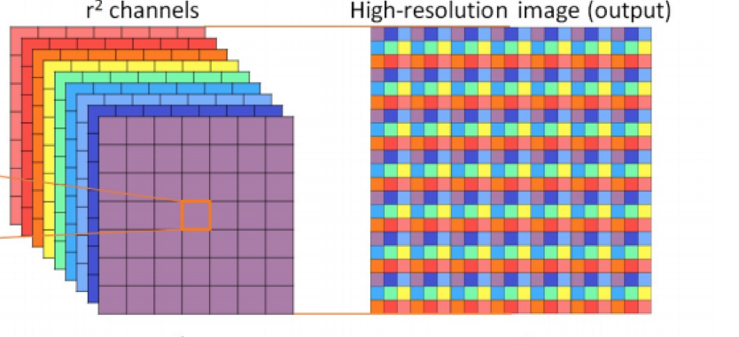

<!-- main header -->
<div align="center">
    <h1>Super Resolution Network</h1>
</div>

<!-- contents -->
<details>
    <summary>Table of Contents</summary>
    <ul>
    <li><a href="#about-the-project">About the project</a></li>
    <li><a href="#getting-started">Getting started</a></li>
    <li><a href="#usage">Usage</a></li>
    <li><a href="#implementation-details">Implementation</a>
        <ul>
            <li><a href="#download-script">Download</a></li>
            <li><a href="#dataset-class">Dataset</a></li>
            <li><a href="#utils">Utils</a></li>
            <li><a href="#residual-convolution-block">Residual convolution block</a></li>
            <li><a href="#subpixel-block">Subpixel block</a></li>
            <li><a href="#sresnet">Sresnet</a></li>
        </ul>
    </li>
    <li><a href="#evaluation">Evaluation</a></li>
    <li><a href="#license">License</a></li>
    <li><a href="#refereces">References</a></li>
    </ul>
</details>

## About The Project

The goal of this project is to develop and train a custom `Super Resolution Neural Network` for image upscaling. The project encompasses various stages, including downloading image data, constructing neural network building blocks, model training, and performance evaluation.

## Roadmap

- [] download script
    - [] DIV2K single use download
    - [] custom url dataset selection
- [] readme
    - [x] getting started
    - [x] usage
    - [] implementation
        - [x] download script
        - [x] dataset class
        - [x] utils
        - [x] residual block
        - [x] subpixel block
        - [] sresnet
- [x] custom dataset loader
- [x] utils
    - [x] image format converter function
    - [x] image training and validation transformer
- [x] SRESNN
    - [x] training script
    - [x] residual convolution blocks
    - [x] subpixel blocks
- [] GAN
    - transfer learning
    - generator model
    - discriminator model
- [] evaluation


## Getting Started

In this section is complete guide with environment and prerequisities setup.

### Prerequisities

#### Ubuntu
 
`python3` is needed for running project code and training or using sresnet model.

Install python and pip using:
```
sudo apt update
sudo apt install python3
sudo apt install python3-pip
```

Test your installation by running:
```
python3 --version
pip3 --version
```

Last prerequisite is to have installed `venv` python package.

```
python3 -m pip install venv
```

### Installation

Now we need to create our python venv and install all packages from requirements.txt.

Create venv with custom name and activate it:
```
python3 -m venv venv
source venv/bin/activate
```

Now just install all packages from requirements.txt:
```
pip install --upgrade pip
pip install -r requirements.txt
```

To deactivate virtual environment run:
```
deactivate
```

## Usage

In this section is explanation how to use pretrained models for upscaling your own images and how to train sresnet on custom data with custom configuration.

### Upscaling

Example usage of image upscaling can be found in `superres.ipynb`. But standard way is to load trained model file.

Trained models are saved in a form of dictionary with `model`, `optimizer`, `epoch`, `tloss`, `vloss` keys.

```
state = torch.load('sresnet.pt')
model = state['model'].to(DEVICE)
```

Your low resolution image (default PIL format) can be then upscaled using `upscale_img` utility function:

```
sr = upscale_img(image, model)
```

Low resolution image size cannot be bigger than 1300 in sum because of the sresnet computational limitation. For example (900, 500) is too big.

### Training your own model

#### Data

First step is to download data. You can use any high resolution image data or use download script for DIV2K images.

Run this with activated venv to download DIV2K image data:
```
python3 download.py
```

#### Training

For training is used `train_sresnet.py` script. So before running this script, you need to specify some important parameters.

- SCALE -> set your own preferred upscale factor
- TRAIN_EPOCHS -> number of epochs
- DATA_DIR -> folder with image data
- PT_SAVED -> trained model file

Feel free to tweak other parameters as well and then just run:
```
python3 train_sresnet.py
```

This will train super resolution model for specified number of epochs and then it saves its parameters into `PT_SAVED` file (default is sresnet.pt).

## Implementation details

### Download script

Download script is implemented as an easy way how to download DIV2K image data and parse it into format which can be used by network data loaders.

It consists of script part, which downloads training and validation data unzips them and moves them into DIV2K folder. The second part is `Downloader` class which shows download progress on its usage. 

### Dataset class

Class inherted from pytorch `Dataset` for custom data loading from custom folder. Takes optional `ImgTransformer` class param for image conversion for sresnet.

### Utils

Module `utils.py` contains functions and classes for image format manipulation.
Main class `ImgTransformer` is used for transforming images in data loader. It has two mods `train`/`validation`

#### ImgTransformer

Takes image as input and returns cropped high res image and its low res variation. Based on its mode, it returns maximal scale divisible crop or crop with size defined in training script config file.

Low res image is created using downscaling high res image using `Image.BICUBIC`.

#### convert_image

Convert image function supports 4 converisons.
- pil (default RGB pil image format)
- [0, 255] (RGB image tensor)
- [0, 1] (scaled tensor)
- [-1, 1] (scaled tensor for tanh activation func)

### Residual convolution block

#### Explanation

Deeper neural networks are challenging to train due to the increased number of layers and issues such as vanishing/exploding gradients. This is where residual blocks with residual learning come into play.

In a standard layer, there is an input $x$ and our layer $F(x)$. Typically, we aim to find the function to obtain $y$. Finding this function is equivalent to determining weights and biases for the vector $x$. This is the basic operation of a standard layer.

Now, let's consider the residual layer. This time, our desired output is $F(x) + x$. (we simply add the input vector to our layer output). What this truly implies is that our function doesn't learn a direct mapping from $x$ to $y$, but rather it learns what to subtract or add from the given input vector.

According to the `Deep Residual Learning` paper, it is easier to find this residual mapping compared to finding a normal input transformation. Consequently, deeper networks can be trained more effectively.


#### Code

Residual convolution blocks are implemented as class inherited from `nn.Module`. It consists of two convolutional layers with `prelu` as activation function for the first one.

Output of this layer is exaclty $F(x) + x$.

### Subpixel block

#### Explanation

Suppose we aim to design a layer capable of upscaling a given vector by a scale $s$. To achieve this upscaling, precisely $s^2$ channels are required, which can later be consolidated into a single channel to enhance the image resolution (as illustrated in the image).

Our subpixel block is composed of a convolution block that generates $s^2$ output channels. Subsequently, these channels are passed through a pixel shuffle operation.



#### Code

Subpixel block is implemented as class inherited from `nn.Module`. It utilizes `nn.Conv2d` -> `nn.PixelShuffle` -> `nn.PReLU`. 

### SResNet

SResNet model consists of 3 main convolutional layers, residual blocks and subpixel blocks.
Because of this structure, it can learn important bonds between low resolution and high resolution images.

This model is explained more in [this](https://arxiv.org/pdf/1501.00092.pdf) science paper.

### Transfer learning

Transfer learning involves reusing a pre-trained model that is then further trained for a specific purpose. In this instance, our primary model is `sresnet`, which aims to minimize `Mean Squared Error (MSE) loss`. The weights of this trained model can be utilized and fine-tuned, for instance, through the use of `Generative Adversarial Networks` (GANs). This approach significantly reduces the time required for training a new super-resolution model from scratch.

### GAN
todo

## Evaluation
todo

## License

Distributed under the MIT license. Visit `LICENSE` for more information.

## References

### Data
- [DIV2K image dataset](https://data.vision.ee.ethz.ch/cvl/DIV2K/)

### Tutorials
- [Super resolution tutorial](https://github.com/sgrvinod/a-PyTorch-Tutorial-to-Super-Resolution)
- [GAN in super resolution](https://jonathan-hui.medium.com/gan-super-resolution-gan-srgan-b471da7270ec)

### Science papers
- [Deep residual learning](https://arxiv.org/pdf/1512.03385.pdf)
- [SRESNN](https://arxiv.org/pdf/1501.00092.pdf)
- [Image quality assessment using SSIM](https://ece.uwaterloo.ca/~z70wang/publications/ssim.pdf)
- [Loss functions in SRESNN](https://arxiv.org/pdf/1511.08861.pdf)

